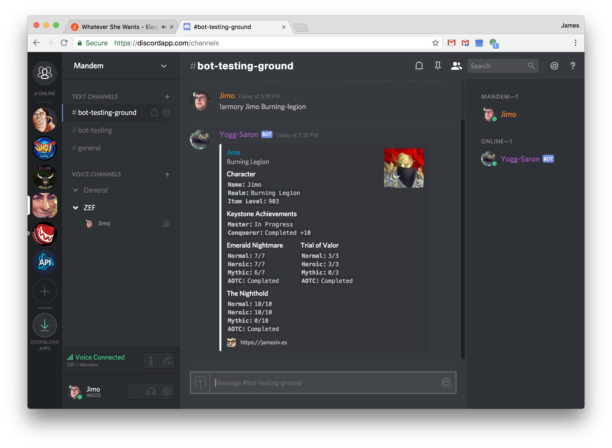

# World of Warcraft Armory Discord Bot ⚔️🗡️

[](https://travis-ci.org/JamesIves/discord-wow-armory-bot) [](https://github.com/JamesIves/discord-wow-armory-bot/issues)

With this bot you're able to lookup a [World of Warcraft](http://worldofwarcraft.com/) character's item level, notable achievements, and pve/pvp progression with a command within [Discord](https://discordapp.com/). 

## Installation Steps :minidisc: 

1. Visit the [Blizzard API website](https://dev.battle.net/) and sign up for an API client id/secret.
2. Visit the [Discord API website and create an application](https://discordapp.com/developers/applications/). You'll need to create a bot user and retrieve the [bot token](https://discordapp.com/developers/docs/intro#bots-and-apps) it provides.
3. Invite the bot user to your server using the following URL by replacing the `YOUR_CLIENT_ID` portion with the one found within your [Discord API settings](https://discordapp.com/developers/applications/): `https://discordapp.com/oauth2/authorize?&client_id=YOUR_CLIENT_ID_HERE&scope=bot&permissions=0`
4. Click the button below and enter the required fields to deploy the bot to [Heroku](http://heroku.com). If the required tokens were provided correctly the bot should appear online within Discord and begin responding to commands. 

[](https://heroku.com/deploy?template=https://github.com/JamesIves/discord-wow-armory-bot/master)

---

If you'd like to run the application outside of [Heroku](http://heroku.com) you can add the required [configuration options](#configuration-file_folder) as environment variables and then run the following commands using [Python](https://www.python.org/) and [Pip](https://pypi.org/project/pip/).

```
# Install & Run
$ pip install -r requirements.txt
$ python app.py

# Tests
$ python tests.py
```

## Configuration :file_folder: 

The installation will require you to enter a number of API keys and settings as environment variables. Below you'll find an explanation of each.

| Key  | Value Information | Required |
| ------------- | ------------- | ------------- |
| `WOW_CLIENT_ID`  | Required to make calls to the Blizzard API, you can sign up for a client id [here](https://dev.battle.net/).  | **Yes** |
| `WOW_CLIENT_SECRET`  | Required to make calls to the Blizzard API, you can sign up for a client secret [here](https://dev.battle.net/).  | **Yes** |
| `WOW_REGION`  | The server region you'd like to query, for example `us`, or `eu`.  | **Yes** |
| `LOCALE`  | The language for your selected WoW region, for example `en_US`, or `en_GB`. Locale depends on region. Please refer to the [Blizzard API documents](https://dev.battle.net/) for more information. At this time this bot will only return data in English.   | **Yes** |
| `DISCORD_BOT_TOKEN`  | The token for your Discord bot user, you can sign up for one [here](https://discordapp.com/developers/docs/intro). | **Yes** |

If a required variable is missing the terminal you executed the bot from will display an error message.


## Commands :computer: 
The following commands are accepted by the bot.

```
# Displays a players PVE progression, dungeon kills, keystone achievements, etc.
!armory pve <name> <realm>
!armory pve <armory-link>

# Displays a players PVP progression, arena ratings, honorable kills, etc.
!armory pvp <name> <realm>
!armory pvp <armory-link>

# You can also provide an optional region to each query to display players from other WoW regions outside of the bot default, for example EU, US, etc.
!armory pve <name> <realm> <region>
!armory pvp <armory-link> <region>

# Displays the currnet wow token price.
!armory token
!armory token <region>

# Command list/help
!armory help
```

## FAQ :speech_balloon: 
Here's a list of frequently asked questions. Please review the [contribution guide](https://github.com/JamesIves/discord-wow-armory-bot/blob/master/.github/CONTRIBUTING.md) if you'd like to support the project.
```
Q: Why does the bot not recognize my realm?
A: Realm names with multiple words must be seperated by a dash, for example burning legion would be burning-legion.

Q: Why does it show that my alt has completed an achievement?
A: Some achievements are account wide so the API response for your alt will be the same as your main.

Q: Do you plan on supporting Mythic+ scores?
A: Only if the official Blizzard API begins supporting their own metric.

Q: Why don't you show this raid?
A: I aim to support the most recent raids in the current expansion. Because Discord has a character limit I will start trimming the oldest raid in the current expansion if necessary.

Q: What expansion does this bot currently support?
A: Battle for Azeroth.
```


