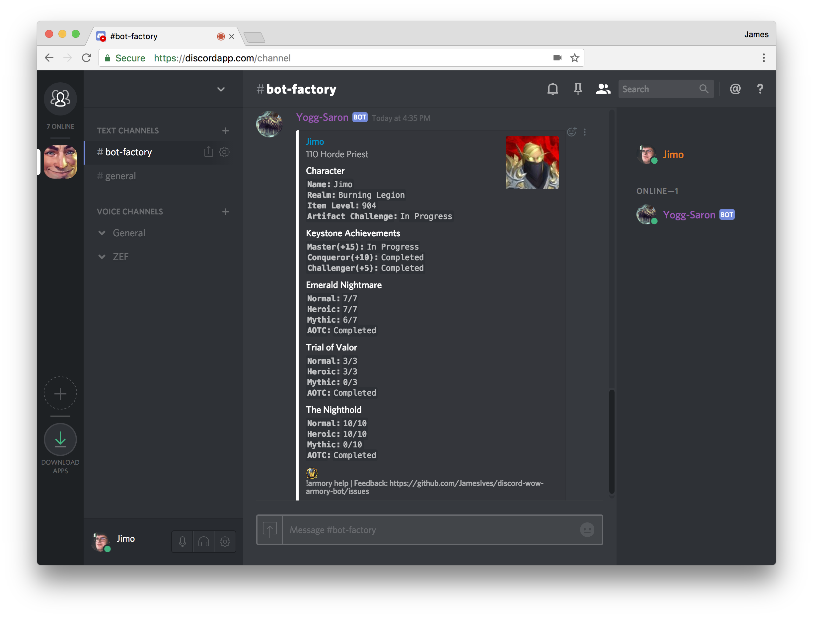

# World of Warcraft Armory Discord Bot

[](https://travis-ci.org/JamesIves/discord-wow-armory-bot) [](https://github.com/JamesIves/discord-wow-armory-bot/issues)

This is a simple Discord bot for World of Warcraft built on [discord.py](https://github.com/Rapptz/discord.py). You're able to enter a character name and realm to get a quick view at a characters item level, notable achievements, and pve/pvp progression.


## Requirements
This application requires [Python 3.6.1](https://www.python.org/) and the following packages which can be installed with pip.

```
discord.py==0.16.7
requests==2.14.2
```

## Deploying the Bot
This bot can be deployed to any service such as [Heroku](https://www.heroku.com).

For [Heroku](https://www.heroku.com) simply deploy the most recent version and assign your free dyno to the worker specified in the Procfile, and then scale it.

```
$ heroku ps:scale --app discord-wow-armory-bot worker=1
```

For one-click install to [Heroku](https://www.heroku.com) you can use the button below. Please refer to the `Configuration` portion of the readme for further instructions.

[](https://heroku.com/deploy?template=https://github.com/JamesIves/discord-wow-armory-bot/master)


## Configuration
In order to power this bot you'll require a [Discord API bot token]((https://discordapp.com/developers/docs/intro)), and a [key for the Blizzard API]((https://dev.battle.net/)). These credentials are stored as environment variables. If you're deploying the bot to [Heroku](https://www.heroku.com) you'll need to go to the `Settings` tab of the application and click `Reveal Config Vars` and replace or add the fields depending on your chosen method of installation.

| Key  | Value Information |
| ------------- | ------------- |
| `WOW_API_KEY`  | Required to make calls to the Blizzard API, you can sign up for a key [here](https://dev.battle.net/).  |
| `WOW_REGION`  | The server region you'd like to query, for example `us`, or `eu`.  |
| `LOCALE`  | The language for your selected WoW region, for example `en_US`, or `en_GB`. Locale depends on region, please refer to the [Blizzard API documents](https://dev.battle.net/) for more information. At this time this bot will only return data in English.   |
| `DISCORD_BOT_TOKEN`  | The token for your Discord bot user, you can sign up for one [here](https://discordapp.com/developers/docs/intro). |

Once you've configured the variables you may need to restart the service. If a variable is missing the terminal you executed the bot from will display an error message.


## Inviting the Bot
Once the application is running you'll need to invite the bot to your Discord server. Replace the `YOUR_CLIENT_ID_HERE` portion of the following URL with the one found in your [Discord API settings](https://discordapp.com/developers/docs/intro).

`https://discordapp.com/oauth2/authorize?&client_id=YOUR_CLIENT_ID_HERE&scope=bot&permissions=0`


## Running the Application
This application can be executed locally by running `$ python3 app.py`. This will initialize the script and connect the bot. If the bot has already been invited to a server it will change its status to online.

There are a number of tests that can be run using `$ python3 tests.py` which check returned values of core functions with sample API data for accuracy.


## Commands
The following commands are accepted by the bot.

```
# Displays a players PVE progression, dungeon kills, keystone achievements, etc.
!armory pve <name> <realm>
!armory pve <armory-link>

# Displays a players PVP progression, arena ratings, honorable kills, etc.
!armory pvp <name> <realm>
!armory pvp <armory-link>

# You can also provide an optional region to each query to display players from other WoW regions outside of the bot default, for example EU, US, etc.
!armory pve <name> <realm> <region>
!armory pvp <armory-link> <region>

# Command list/help
!armory help
```

## FAQ
Here's a list of frequently asked questions.
```
Q: Why does it show that my alt has completed an achievement?
A: Some achievements are account wide so the API response for your alt will be the same as your main.

Q: Do you plan on supporting Mythic+ scores?
A: Only if the official Blizzard API begins supporting their own metric.

Q: Why don't you show this raid?
A: I aim to support the most recent raids in the current expansion. Because Discord has a character limit I will start trimming the oldest raid in the current expansion if necessary.
```

## Issues, Feedback and Feature Requests
Please post any issues, feedback, or feature requests [here](https://github.com/JamesIves/discord-wow-armory-bot/issues).



